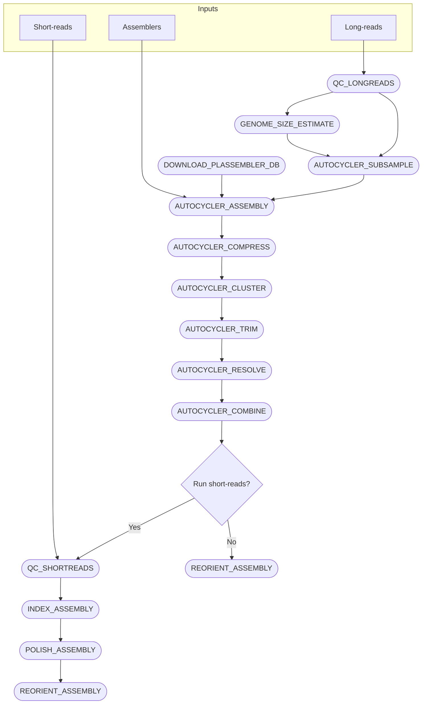

# An automated Nextflow pipeline for Autocycler using Docker
## Usage

1. You will need to install [Nextflow](https://nextflow.io/docs/latest/install.html) and [Docker](https://docs.docker.com/engine/install/).

2. Clone this repository to your local machine:

   ```
   git clone https://github.com/wtmatlock/autocycler-pipeline.git
   cd autocycler-pipeline
   ```

3. Add your input data to the appropriate directories:

- Place your long-read FASTQ files in a `long_reads` directory, naming each file with its sample label (e.g. `sample1.fastq.gz`, `sample2.fastq.gz`).
- If you have paired-end short reads, add them to a `short_reads` directory using the convention `sample1_1.fastq.gz` and `sample1_2.fastq.gz` for each sample. In the `nextflow.config`, ensure that `runShortReads = true`. 
- Review and adjust the `nextflow.config` file to set resource requirements (e.g. `threads = 8` and `memory    = '16 GB'`), and assemblers (e.g. `assemblers = ["canu", "flye", "miniasm", "plassembler", "raven"]`). Currently, the pipeline supports Canu, Flye, Miniasm, Plassembler, and Raven.

4. You can then launch the pipeline with:
   ```
   nextflow run main.nf
   ```

5. Outputs will be organised by sample label in the `outputs` directory. The final assembly FASTA is found in `${params.outdir}/${sampleId}/reoriented_assembly`.

> Note: if you are running on linux/arm64 (Apple Silicon), you will need to use Docker's emulation for linux/amd64. This is currently the default in the `nextflow.config` with `runOptions = '--platform=linux/amd64'`.

> The Dockerfile for the Autocycler container is included in this repository but is not required to run the pipeline. Currently, it is set to use the most recent version of Autocycler (v. 0.4.0).

## Workflow



## Directory layout

```bash
./
├── nextflow.config           # Nextflow config
├── main.nf                   # Nextflow script
├── bin/                      # Assembler helper scripts from Autocycler
│   ├── canu_trim.py
│   ├── canu.sh
│   ├── flye.sh
│   ├── genome_size_raven.sh
│   ├── miniasm.sh
│   ├── plassembler.sh
│   └── raven.sh
├── long_reads/               # Input long-reads
│   ├── sample1.fastq.gz
│   ├── sample2.fastq.gz
│   └── ...
├── short_reads/              # Input short-reads
│   ├── sample1_1.fastq.gz
│   ├── sample1_2.fastq.gz
│   ├── sample2_1.fastq.gz
│   ├── sample2_2.fastq.gz
│   └── ...
└── outputs/                  # Output directories are created
    ├── sample1/
    ├── sample2/
    └── ...
```
